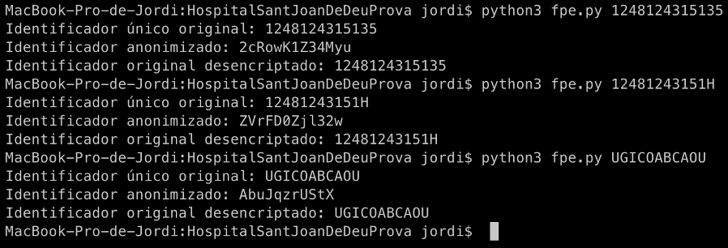

# Prueba técnica del Hospital Sant Joan de Déu

## Enunciado

Nuestro hospital se ha anexado a una red de hospitales que ceden datos anonimizados de pacientes para un proyecto de investigación.

Se requiere establecer un sistema que anonimice los identificadores de los pacientes.

Los requerimientos son los siguientes:
- Tiene que ser posible re identificar los pacientes. Dado un identificador de paciente anonimizado tiene que ser posible recuperar el identificador original.

- Determinista. Un mismo identificador de paciente siempre tiene que tener asociado el mismo identificador anonimizado a lo largo del tiempo, de tal manera que se puedan hacer actualizaciones consistentes.

- Perfecta. Diferentes identificadores no pueden tener el mismo identificador anonimizado (evitar colisiones).

- A ser posible, que mantenga el formato. Si el identificador es un número el identificador anonimizado también lo tiene que ser.

Los datos a enviar son “n” tablas relacionadas donde se requiere seudonimizar el campo “clau codi HC”.


## Solución

El identificador único anonimizado de cada paciente será un cadena de caracteres codificado a partir de su identificador único (como puede ser el DNI o su identificador de la CatSalut), de manera que no habrá colisiones, y una clave (que solo conoce el personal autorizado), con la cual se puede decodificar la cadena de caracteres para obtener su identificador único y así obtener su identidad.

Para ello se puede usar un algoritmo de encriptación como Format-Preservering Encryption (FPE). Este algoritmo determinista permite codificar una cadena de caracteres o números, nuestro identificador del paciente, usando una clave (una cadena de caracteres) y manteniendo el formato (de manera que si el identificador original son solo números, el anónimo también serán números).

A continuación muestro un ejemplo usando Python:
```python
import pyffx
import sys
import string

# identificador único del paciente pasado por parametro
patient_identifier = sys.argv[1]
key = b'HospitalSantJoanDeDeu' # clave convertida en bytes

# El identificador puede contener letras y números
alphabet=string.ascii_letters+string.digits

# Creamos en objeto para encriptar usando el algoritmo FPE a partir de la clave definida
encryptor = pyffx.String(key, alphabet=alphabet,length=len(str(patient_identifier)))

# Obtemos el identificador anonimizado del paciente
identifier_anonymized = encryptor.encrypt(patient_identifier)
# Descencriptamos el identificador y obtenemos el original
identifier_decrypted = encryptor.decrypt(identifier_anonymized)

print(f'Identificador único original: {patient_identifier} \nIdentificador anonimizado: {identifier_anonymized}\nIdentificador original desencriptado: {identifier_decrypted}')
```
La ejecución de este script muestra la siguientes salidas dónde se aprecia que mantiene el formato.


